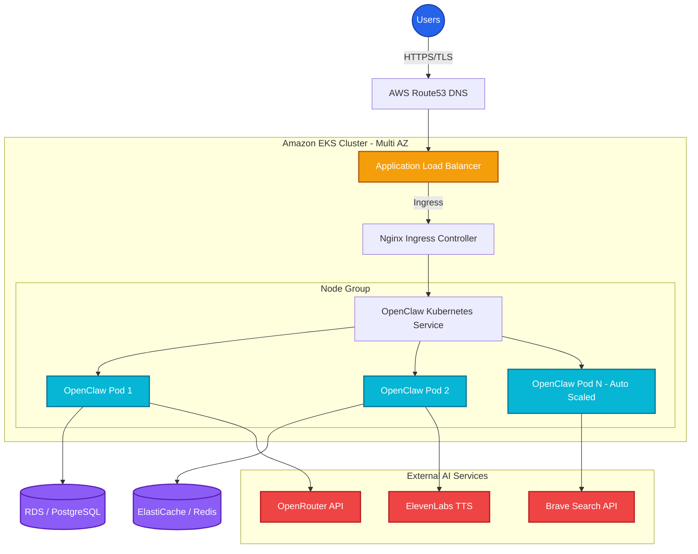

# 🏗 Professional Architecture Diagram

Here is the Mermaid.js representation of the OpenClaw Enterprise Architecture. You can render this directly in GitHub, Notion, or copy it into tools like draw.io / Mermaid Live Editor.

